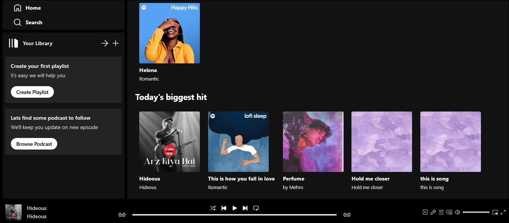

# Spotify Clone – Music Streaming App

Spotify Clone is a full-stack music streaming application built with **MERN stack** and **Tailwind CSS**. Users can play, pause, skip tracks, and admins can upload music and albums. The app also tracks how many times each track is played.



---

## Live Demo
[Frontend Live Link](https://spotify-clone-frontend-hyn0.onrender.com)  
[Backend Wake-Up Link](https://spotify-clone-backend-knb2.onrender.com)

---

## Features

- Play, pause, next, and previous tracks  
- Admin panel to upload music and albums  
- Tracks the number of times each track is played  
- Fully responsive music player  

---

## Tech Stack

### Frontend
- React.js  
- Tailwind CSS  

### Backend
- Node.js  
- Express.js  
- MongoDB (for track, album, and user data)  

### Other
- Axios for API requests  

---

## Installation & Setup

### Step 1: Clone the repository
```bash
git clone https://github.com/YOUR_USERNAME/spotify-clone.git
```
### Step 2: Navigate to the project directory
```
cd spotify-clone
```
## Step 3: Configure environment variables

Create a .env file in the server folder:

```PORT=5000
MONGO_URI=your_mongodb_uri
```

## Step 4: Install dependencies

Backend
```
cd server
npm install
```

Frontend
```
cd ../client
npm install
```
## Step 5: Run the application

Start backend
```
cd server
npm start
```
Start frontend
```
cd ../client
npm start
```

Frontend runs on: http://localhost:3000

Backend runs on: http://localhost:5000
